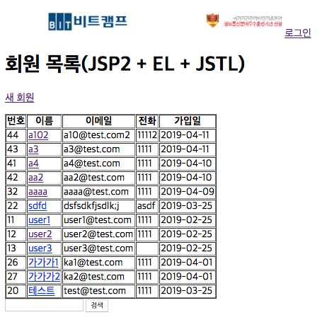
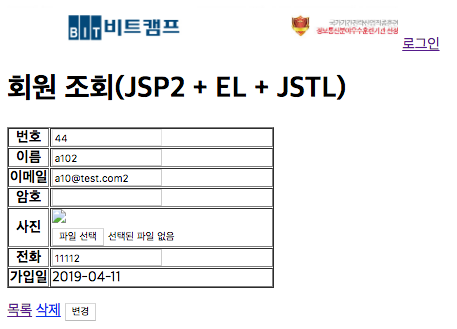

# UC1 - 관리자 숙소관리(Manager CRUD)

매니저를 등록, 조회, 변경, 삭제하는 유스케이스이다.

## 주 액터(Primary Actor)
관리자

## 보조 액터(Secondary Actor)

## 사전 조건(Preconditions)

- 관리자로 로그인 되어 있다.

## 종료 조건(Postconditions)

- 관리자가 호스트 숙소관리 리스트 조회
- 관리지가 호스트 숙소관리 리스트 삭제

## 시나리오(Flow of Evnets)

### 관리지가 호스트 숙소 관리 리스트 조회

1. 관리자가 관리자 페이지에서 숙소관리 메뉴 클릭
2. 시스템은 숙소관리 폼 을 출력(한 페이지당 10개 리스트)(평점추가)
3. 관리자는 평점과 승인여부(필터)를 적용후 조회하기 버튼 클릭
       -숙소 관리 페이지 출력
4. 관리자는 리스트 목록이 많을경우 다음페이지 클릭(<1,2,3,4>)

### 관리지가 호스트 숙소 관리 리스트 삭제

1. 관리자가 관리자 페이지에서 숙소관리 메뉴 클릭
2. 시스템은 숙소관리 폼 을 출력(항목번호에 전체 선택 체크박스,각 항목당 체크박스)
3. 관리자가 체크박스 리스트 선택후 삭제 버튼 클릭
4. 시스템은 삭제 팝업 출력 (예 /아니오 선택 가능)
          - 예 를 클릭시  정상적으로 삭제처리 
                   -숙소 관리 페이지 출력
          - 아니오 를 클릭시 현제 페이지 유지

## UI 프로토타입

### 숙소 관리

### 숙소 관리 삭제 팝업
